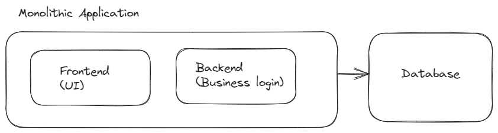
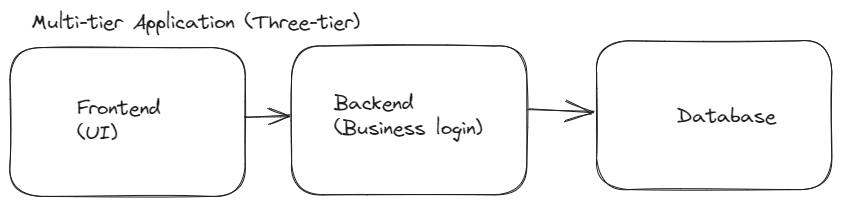
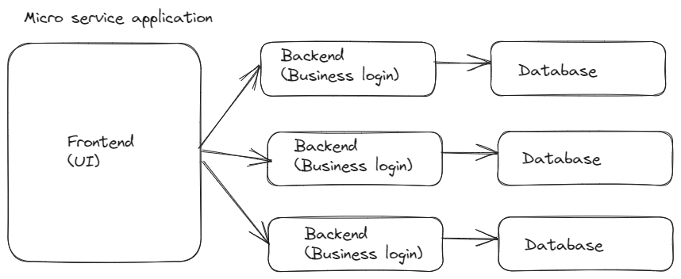
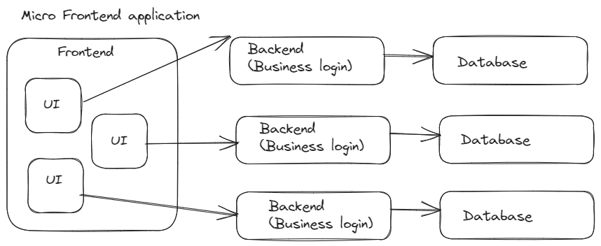

# Micro Frontend

> Before starting the MicroFrontend we need to understand the evolution of software from monothilic to microfrontend

<!-- 
<details>
<summary>

</summary>
</details> -->


<details>
<summary>
 Monolithilic application   
</summary>

```
Here the simplified diagram of monolithic application
where the frontend (ui ) and backend are in the same code base eg: Djnago, MVC application

```



> Pro
1. Easy deployments
2. Easy scalability (horizontal scaling) that is just need to have a copy of the application load balancer will take care of the traffic
> con 
1. Difficult to load in IDE and finding erros as Larger codebase 
2. Smaller changes need complete build and re deployment of entire application.
</details>
 
 
<details>
<summary>
 Multi tier application   
</summary>

```
Here the simplified diagram of Multi tier application
where the frontend (ui ) and backend are in the different code base eg: Frontend in react , APi in c#

```



> Pro
1. Code base is split
2. Easy to identify the error than monolithic
> con 
1. Though the code base is split still we have a larger codebase for backend and frontend which affect build , deployment and findind bugs  

</details>


<details>
<summary>
Micro service application   
</summary>

```
Here the simplified diagram of Microservice application
where the frontend (ui ) and backend are seperated and the backend part is further seperated for eg : consider an e-commerce website having order,product,cart service
which are running as a different backend services and consumed by single frontend.

```



> Pro
1. Code base is further split
2. Easy to identify the error 
3. Team can code in their preferred programming language
> con 
1. Integrataion of logic eg: fetch data
2. Increasing number of API calls

</details>
 
 
<details>
<summary>
Micro Frontend application   
</summary>

```
Here the simplified diagram of Micro frontend application
which is looks similar to microservice but invloves spliting the frontend part as different service such as product page, cart page etc,.

```



> Pro

1. Team can code in their preferred programming language in frontend also

> con 
1. Integration of different frontend application and their challenges

> Tip : Micro service it self made the application more modular and need a complex deployment if we further make it micro frontend it will make more resource and make deployment complex . Try to use micro frontend if needed and recommended for only medium - large size application
</details>


<details>
<summary>
Exceptation of Micro Frontend
</summary>


```
1. More modular and zero coupling application ( One application is independent of other )
2. Team can code on their preferred languages
3. Reuse
4. Independent Developement

```

</details>

<details>
<summary>
Challenges of Micro Frontend
</summary>


```
1. Communication between different application
2. Shared Dependencies
3. Integration


```

</details>


<details>
<summary>
 Integration approches
</summary>

1. Build-time integration
2. Run-time integration 

</details>

 


